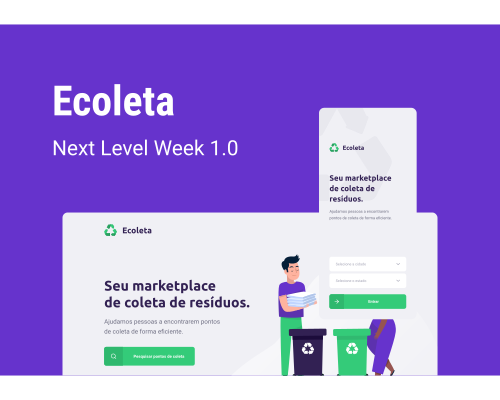

## 💻 Projeto - Ecoleta 

<h1 align="center">
    
</h1>

O Ecoleta é um marketplace que ajuda pessoas a encontrarem pontos de coleta de resíduos de forma eficiente.

## 🚀 Technology

Esse projeto foi desenvolvido com as seguintes tecnologias:

- [x] [Node.js](https://nodejs.org/en/)
- [x] [React](https://reactjs.org)
- [x] [React Native](https://facebook.github.io/react-native/)
- [x] [Expo](https://expo.io/)

## Participants

### Author

- [x] [Diego Fernandes - Rocketseat](https://github.com/Rocketseat)

### Reproduzido por:

- [x] [Paulo Henrique Barbosa Santos](https://www.linkedin.com/in/paulo-henrique-barbosa/)

## Contributing

Projeto construído durante a semana Next Level Week #1 da Rocketseat
